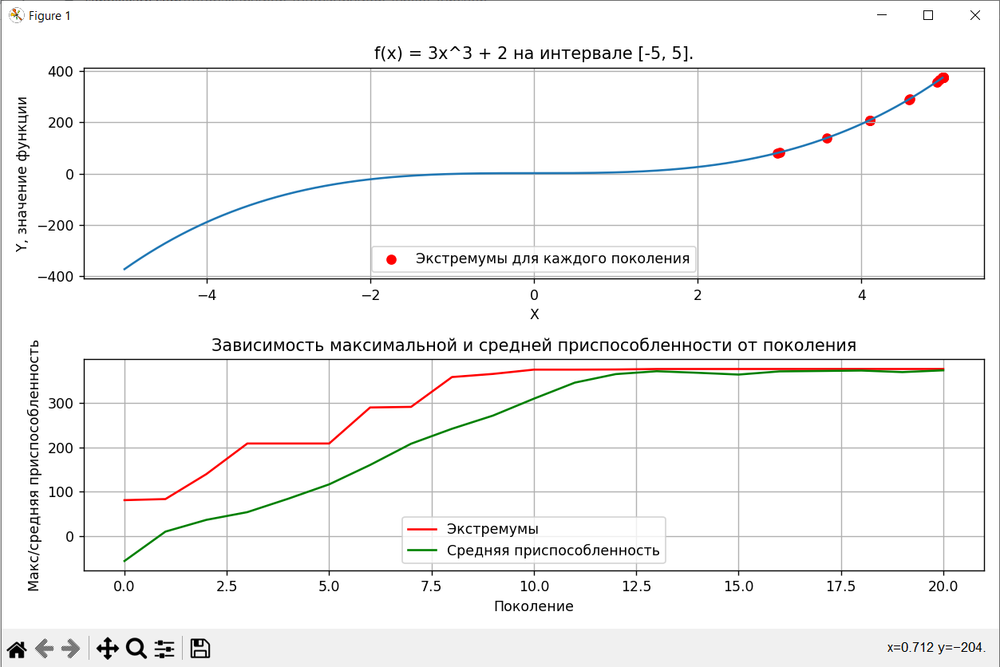

# Genetic algorithm

Genetic algorithms use principles and terminology borrowed from the biological science of genetics. In a genetic algorithm, each individual represents a potential solution to some problem. In a classical genetic algorithm, an individual is encoded by a string of binary characters - a chromosome, each bit of which is called a gene. A set of individuals – potential solutions – makes up a population. The search for a (sub)optimal solution to a problem is carried out in the process of population evolution - the sequential transformation of one finite set of solutions into another using the genetic operators:  

* Reproduction
* Crossing over
* Mutation

## Algorithm

  

## Task 1

Find the extremum of the function:  

```txt
f(x) = cos(x)/ (1+exp(-x)); xϵ[0.5,10]  
```

Solution:  

```txt
# genetic algorithm constants
POPULATION_SIZE = 30    # number of individuals in a population
P_CROSSOVER = 0.5       # probability of crossing
P_MUTATION = 0.2        # individual's mutation probability
MAX_GENERATIONS = 20    # maximum number of generations
```

Result:  
  
Output:  

```txt
   	      	          extremum_individs           	                    stats                     
   	      	--------------------------------------	----------------------------------------------
gen	nevals	extremum_individ      	gen	nevals	avg      	gen	max     	nevals
0  	30    	[[0.6107195910253407]]	0  	30    	-0.533009	0  	0.530951	30    
1  	17    	[[0.5754211741746396]]	1  	17    	-0.0311056	1  	0.536947	17    
2  	18    	[[5.29811375458303]]  	2  	18    	0.383148  	2  	0.550053	18    
3  	16    	[[5.303774736735046]] 	3  	16    	0.504661  	3  	0.554753	16    
4  	23    	[[5.766599420067781]] 	4  	23    	0.535721  	4  	0.866797	23    
5  	12    	[[6.192861872745032]] 	5  	12    	0.600617  	5  	0.993892	12    
6  	21    	[[6.332882511682149]] 	6  	21    	0.668745  	6  	0.996994	21    
7  	19    	[[6.332882511682149]] 	7  	19    	0.765109  	7  	0.996994	19    
8  	20    	[[6.330963166943754]] 	8  	20    	0.944787  	8  	0.997084	20    
9  	22    	[[6.330963166943754]] 	9  	22    	0.960988  	9  	0.997084	22    
10 	22    	[[6.3270111194466265]]	10 	22    	0.95432   	10 	0.997257	22    
11 	16    	[[6.2883236453190055]]	11 	16    	0.990772  	11 	0.998132	16    
12 	19    	[[6.2883236453190055]]	12 	19    	0.994719  	12 	0.998132	19    
13 	20    	[[6.2883236453190055]]	13 	20    	0.971264  	13 	0.998132	20    
14 	15    	[[6.2867404891311764]]	14 	15    	0.981869  	14 	0.998136	15    
15 	18    	[[6.286415852391354]] 	15 	18    	0.984119  	15 	0.998137	18    
16 	19    	[[6.2862769911651935]]	16 	19    	0.985979  	16 	0.998137	19    
17 	16    	[[6.286275746029035]] 	17 	16    	0.99575   	17 	0.998137	16    
18 	14    	[[6.286275746029035]] 	18 	14    	0.928108  	18 	0.998137	14    
19 	16    	[[6.286275746029035]] 	19 	16    	0.982353  	19 	0.998137	16    
20 	21    	[[6.286275738508809]] 	20 	21    	0.993089  	20 	0.998137	21  
```

## Task 2

Find the extremum of the function:  

```txt
f(x) = 3x3^2; xϵ[-5,5]  
```

Solution:  

```txt
# genetic algorithm constants
POPULATION_SIZE = 30    # number of individuals in a population
P_CROSSOVER = 0.5       # probability of crossing
P_MUTATION = 0.2        # individual's mutation probability
MAX_GENERATIONS = 20    # maximum number of generations
```

Result:  
  

Output:  
```
   	      	          extremum_individs           	                stats                 
   	      	--------------------------------------	--------------------------------------
gen	nevals	extremum_individ      	gen	nevals	avg     	gen	max    	nevals
0  	30    	[[2.9761599237748086]]	0  	30    	-56.1618	0  	81.0843	30    
1  	19    	[[3.0065942851837537]]	1  	19    	10.1044 	1  	83.5353	19    
2  	17    	[[3.5819438237821686]]	2  	17    	36.621  	2  	139.872	17    
3  	13    	[[4.100939095161952]] 	3  	13    	54.0256 	3  	208.905	13    
4  	18    	[[4.100939095161952]] 	4  	18    	84.3323 	4  	208.905	18    
5  	23    	[[4.100939095161952]] 	5  	23    	116.74  	5  	208.905	23    
6  	25    	[[4.579866223909557]] 	6  	25    	160.497 	6  	290.19 	25    
7  	19    	[[4.586806134338224]] 	7  	19    	208.391 	7  	291.503	19    
8  	13    	[[4.917822338727544]] 	8  	13    	242.142 	8  	358.812	13    
9  	18    	[[4.949932088314482]] 	9  	18    	271.819 	9  	365.847	18    
10 	22    	[[4.993501102432448]] 	10 	22    	310.011 	10 	375.54 	22    
11 	14    	[[4.993501102432448]] 	11 	14    	346.212 	11 	375.54 	14    
12 	19    	[[4.9950424966755715]]	12 	19    	365.434 	12 	375.886	19    
13 	19    	[[4.999827051584804]] 	13 	19    	371.923 	13 	376.961	19    
14 	19    	[[4.999832787404488]] 	14 	19    	368.423 	14 	376.962	19    
15 	18    	[[4.999832787404488]] 	15 	18    	364.387 	15 	376.962	18    
16 	18    	[[4.999927116284773]] 	16 	18    	371.591 	16 	376.984	18    
17 	16    	[[4.999927116284773]] 	17 	16    	372.492 	17 	376.984	16    
18 	14    	[[4.999999957684295]] 	18 	14    	373.465 	18 	377    	14    
19 	16    	[[4.999999957684295]] 	19 	16    	369.964 	19 	377    	16    
20 	21    	[[4.999999962519402]] 	20 	21    	373.951 	20 	377    	21 
```